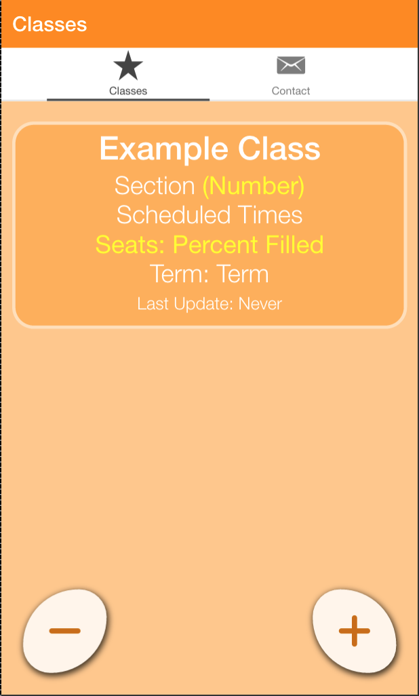
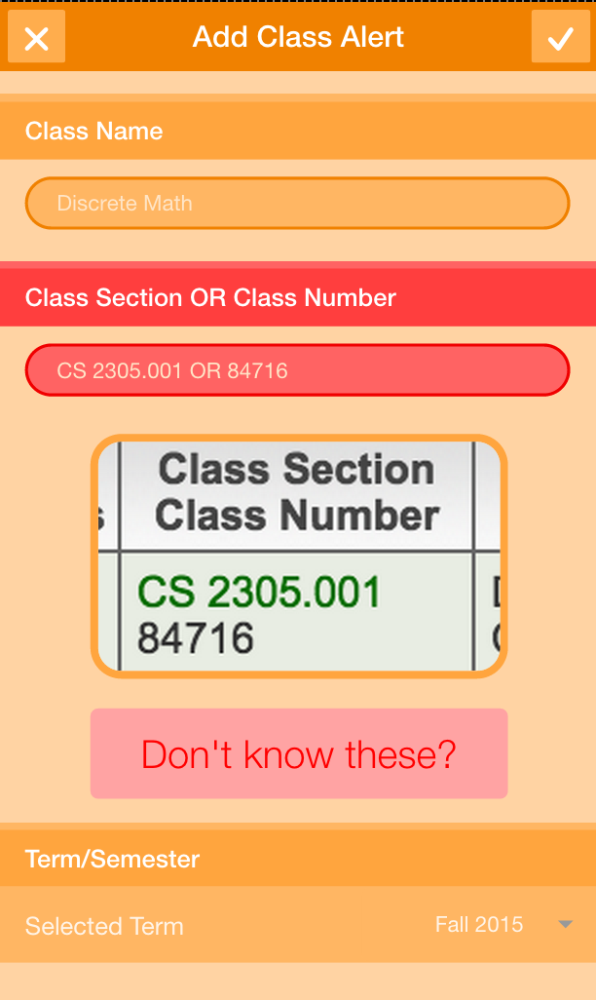
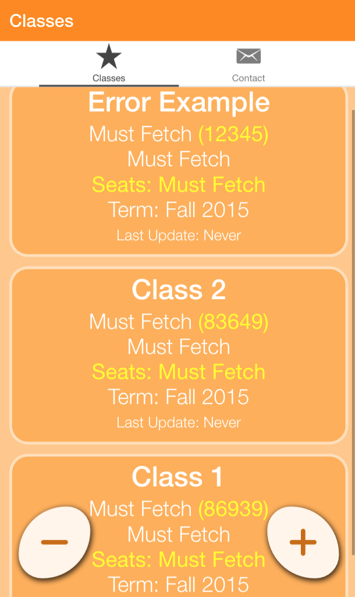
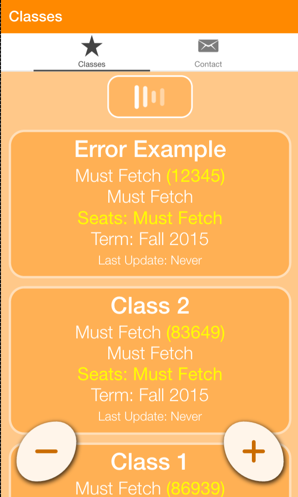
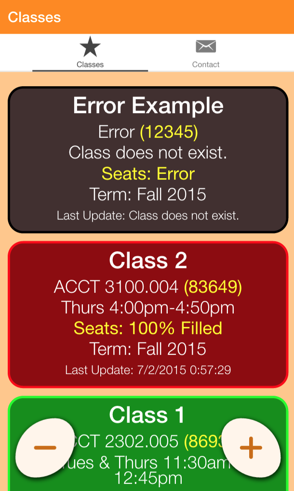
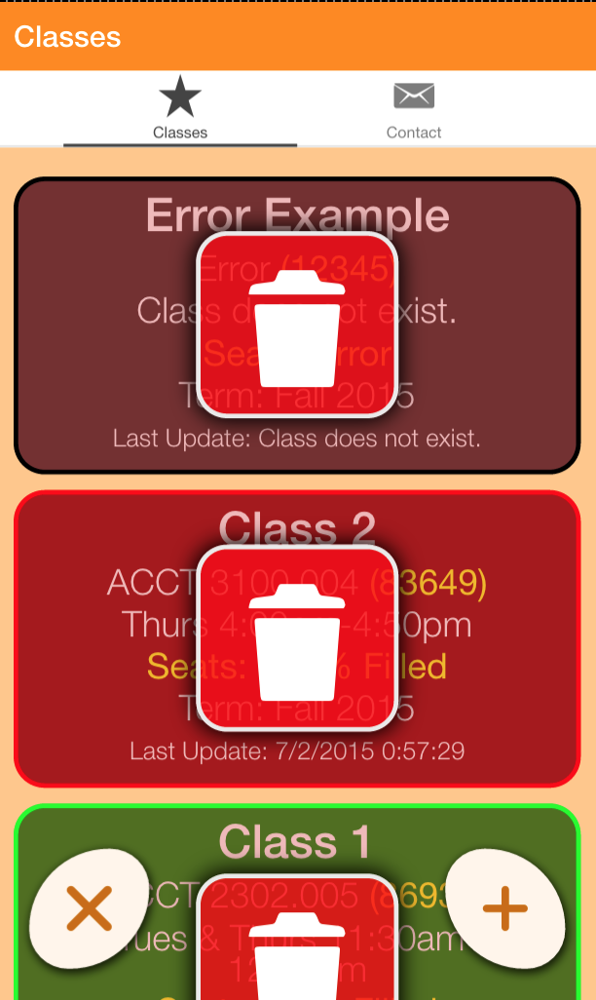

# classChecker
### Ionic App that checks to see if the UTD class you want has opened

Made summer 2015 as a project to gain familarity with ionic and AngularJS.

Uses whateverorigin.org to aid in page scraping (in order to bypass same-origin policy imposed on client side javascript).

___
Example:

___
#License: MIT
